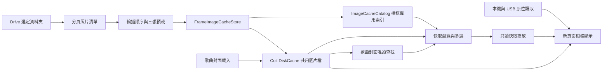

# 全新相框頁面：既有功能承接、Google Drive、三張預載與共用圖片快取規畫

建立日期：2026-09-10；修訂日期：2026-09-12。狀態：第 0 階段 Drive 讀取與相框播放增量已實作，仍未完成整體 v2 規畫，也未宣稱真實車機驗收通過。

## 目前實作範圍（13.7.10）

2026-09-12 使用者確認經測試與修正後已可在手機運作，車機尚未驗證。13.7.10 在相框 2 可用時隱藏主選單的相框 1，保留其路由、程式、設定與資料；主選單恢復四項，不提供 v2 的建置仍顯示原相框。相框 2 齒輪改用等寬來源卡片、圓角分組、固定標題與完成按鈕，整理資料夾列表和顯示設定，並可展開較長的連線／快取說明。以下保留 13.7.8 以來的功能範圍；舊版的隱藏不等同移除。

13.7.8 將「數位相框 2」入口改放在主選單、緊鄰原有相框；移除原先規畫中的設定頁入口。進入後立即以最後選取的本機照片或 Drive 資料夾開始全螢幕輪播；保存的 Drive 帳戶若授權仍有效則靜默授權，若已過期只由齒輪要求重新連接，不自動重複同意流程。本機來源保留原有自動輪播；Drive 才使用雲端預載／快取，第一張立即顯示，再預載目前隨機輪次接下來最多三張壓縮照片，預載不解碼，只有目前照片解碼且長邊上限 1920。雲端可從齒輪暫停／繼續，控制層第二列分開提供歌曲上一首／播放暫停／下一首、照片上一張／下一張、齒輪與退出。

本機來源沿用既有程式的 MediaStore 內部儲存、USB／SD、direct USB、分頁多選、目錄與顯示設定行為，但 v2 使用獨立 preference keys、index 與 ViewModel，不遷移舊選取。相框顯示沿用原有時間／歌曲／歌手半透明第一列，第二列提供音樂上一首／播放／下一首、照片上一張／下一張、齒輪與退出；來源選擇只從齒輪進入。雲端共用快取與預載仍保留，並支援上一張的播放歷史；開啟齒輪時暫停照片輪播與預載，仍可瀏覽及選擇來源；進背景則停止本機載入與雲端工作。

使用既有共用 Coil DiskCache 與容量／清除設定；快取 key 包含帳戶、file ID、版本／modifiedTime／size。命中快取不下載，新增、缺失或版本變更才下載；單一下載有上限，損壞／不可用項目略過，下一張載入時仍保留目前畫面。進背景會關閉播放並釋放解碼圖片與下載工作，但保留來源選擇與快取；返回時本機或仍有效的 Drive 授權會自動使用保存來源，過期授權才須由齒輪重新連接。快取容量為 0 時只使用單一暫存檔、不預載且不保留。網路失敗時，工作階段已有快取的照片仍可繼續播放。

這個增量沒有獨立離線相簿／gallery、ImageCacheCatalog 或本機資料遷移；完整離線啟動與 gallery 仍是後續範圍。原先「開始前先準備三張」的目標調整為第一張先顯示，再向前預載最多三張以縮短首次等待；本文件後續長篇段落保留作為未來完整 v2 的設計目標，不代表本次已完成。

## 已確定的使用範圍與開發方式

本 App 僅供個人使用，不在 Google Play 商店發行。目標車機有 Google 服務，但可能經廠商精簡，不能預先假設 OAuth API 完整可用。不規畫無 Google 框架的替代登入方案，改以目標車機實測及可獨立停用／拆除的 Drive 整合處理失敗。

早期規畫曾以設定 →「相框 2（測試）」作為入口，13.7.8 改放主選單，13.7.10 則在 v2 可用時隱藏原相框入口；以下長篇段落保留當時的完整 v2 目標，與上方 13.7.8 已實作範圍分開。後續工作為舊選取資料遷移、獨立快取索引、快取瀏覽與離線選片播放；本機／USB、Drive 資料夾與共用快取的已完成範圍以上述 13.7.8 說明為準。

開發與真機驗收期間，現有數位相框的畫面、設定、照片清單與路由維持原狀；依使用者於 2026-09-12 的指示，v2 可用時僅隱藏原相框的主選單入口。新功能完成、舊功能全部通過對照驗收且資料承接成功後，才進入獨立的舊版完整移除階段；不在新頁面尚未完成時替換舊版。

Google Drive 採個人帳戶 OAuth 與 `drive.readonly`，由車機直接呼叫 Drive API。先完成個人帳戶授權驗證，不把 Play 商店上架、公開使用者驗證、無 GMS 登入或後端配對服務列入本計畫。

共用快取明確拆成兩層：Coil DiskCache 保存歌曲封面與 Drive 圖片的實際檔案；ImageCacheCatalog 只保存 Drive／相框專用索引，可獨立刪除。Drive OAuth SDK 整合集中在單一 `GoogleDriveOAuth.kt`，不修改現有音樂帳號登入流程。

## 已確認的專案現況

| 項目 | 現況與實作位置 |
| --- | --- |
| 照片來源 | 本機、MediaStore、USB，保存來源 URI；`FrameModels.kt`、`PhotoCatalog.kt`、`FramePhotoSources.kt`。 |
| 播放 | 隨機輪播、播放歷史、上一張／下一張及單張預載；`PhotoFramePlayback.kt`。 |
| 圖片載入 | `PhotoFrameScreen.kt` 只接受 `content`／`file`，停用記憶體、磁碟與網路快取，解碼尺寸上限為長邊 1920。 |
| 生命週期 | 相框進背景、開啟設定或照片瀏覽器時停止輪播載入，保留 URI 型態的播放進度。 |
| 封面快取 | `App.kt` 的單一 Coil ImageLoader，磁碟位於 `cacheDir/coil`，預設 512 MiB；音訊快取是另一套機制。 |
| 快取設定 | `StorageSettings.kt` 支援容量與整體清除，沒有逐張索引、瀏覽或選片。 |
| 音樂登入 | `LoginScreen.kt` 使用 WebView 與 YouTube Cookie，沒有 Drive OAuth access token。 |
| 資料保存 | 相框來源／設定使用 DataStore；本機資料夾照片索引為 `filesDir/photo_frame/index-v1.json`，不在音樂 Room 資料庫內。 |
| 建置版本 | 有 Foss、GMS、Izzy flavors；目前沒有 Drive 授權依賴。功能測試與個人安裝規畫採 GMS 版；目標車機雖有 Google 服務，OAuth 能否運作仍需實測。 |

上述檔案均位於 `app/src/main/kotlin/com/metrolist/music/` 對應子目錄。

## 1. Google 帳戶與資料夾授權

「登入 YouTube Music」不等於「授權讀取 Drive」。在新頁面的設定新增「連接 Google Drive」，明確顯示授權帳戶；使用者可以選擇與音樂相同的 Google 帳戶，但不能拿 YouTube Cookie 或頻道 ID 當作 Drive 身分或權限。Google 官方也將登入與 API 授權分為不同流程。[Android 授權文件](https://developer.android.com/identity/authorization)

指定採用 `https://www.googleapis.com/auth/drive.readonly`：在新頁面內瀏覽資料夾，讀取指定資料夾的既有照片，重新整理時取得新增照片。API 權限涵蓋整個 Drive 的唯讀存取，實際資料清單及下載只對使用者選取的範圍執行。不加入寫入、修改、上傳或刪除 Drive 原始檔的操作。[Drive scopes](https://developers.google.com/workspace/drive/api/guides/api-specific-auth)

依 Google 的個人使用例外，本次不以完成 OAuth 公開驗證為開發前提；授權時可能看到未驗證應用提示。這項判斷來自個人使用範圍，而非 APK 是否上架 Play 商店。[個人使用的驗證例外](https://support.google.com/cloud/answer/13464323?hl=en)

### 個人帳戶設定與建置

1. 建立個人 Google Cloud 專案、啟用 Drive API、設定 OAuth 同意畫面與 `drive.readonly`。一般個人 Google 帳戶使用 External audience，不把個人使用誤設為僅適用 Workspace 組織的 Internal。
2. 建立 Android OAuth client，登記實際安裝版本的 application ID 與簽署憑證 SHA-1；Debug 與個人簽署版本分別核對。
3. 在 GMS flavor 加入 `AuthorizationClient` 所需依賴，透過官方授權流程選取自己的帳戶。共用頁面以授權介面隔離依賴；其他 flavors 維持可建置，不實作替代登入路徑。GMS flavor 是本次建置選擇，不代表必須上架商店。
4. 裝置直接取得短效 access token 並呼叫 Drive；後續透過 `AuthorizationClient` 再取得 token，不另建後端、不在 APK 保存 web client secret，也不使用原有 WebView Cookie 流程。[Android 授權設定與 token 維護](https://developer.android.com/identity/authorization)
5. 開發測試時將本人加入 test users。長期自用的 OAuth 專案採 In production 設定，仍只自行安裝使用；此設定是 OAuth 狀態，並非 Play 商店發行。Testing 狀態下 Drive 授權會在同意後七日到期，需把這件事納入測試，而非誤判為相框故障；正式自用仍須處理一般 token 到期與撤銷。[OAuth audience 與狀態](https://support.google.com/cloud/answer/15549945?hl=en)

### OAuth 集中單檔，與音樂帳號隔離

以下為規畫新增的檔案，不是本次建立的 App 程式碼：

| 檔案／介面 | 責任與界線 |
| --- | --- |
| `app/src/gms/kotlin/com/metrolist/music/photo/v2/drive/GoogleDriveOAuth.kt` | 唯一的 Drive Google OAuth SDK 實作檔。集中 Google 服務可用性檢查、`AuthorizationClient`、scope、帳戶選擇、授權結果解析、短效 token 取得／失效處理、取消與錯誤映射。 |
| `DriveAuthorizationProvider.kt`（新相框共用模組） | 小型、不含 Google SDK 型別的介面與結果模型，例如可用／需互動／已取消／裝置不支援／授權失敗；呼叫端不直接使用 `AuthorizationClient`。 |
| `DrivePhotoRepository.kt`（新相框模組） | 經上述介面取得 token，處理 Drive REST 請求與照片清單；不處理音樂登入，也不實作 OAuth SDK 流程。 |
| 新相框專用 DI 註冊 | GMS 版只在這裡綁定 `GoogleDriveOAuth`；其他 flavors 或拆除後綁定不可用實作，維持編譯，不提供替代登入。 |

- OAuth 只在新頁面選擇 Drive、使用者按連接／重試，或已啟用的 Drive 工作需要 token 時延遲建立；App 啟動、舊相框、本機／USB 與快取模式不初始化它。
- `LoginScreen.kt`、YouTube Cookie、音樂帳戶設定、`App.forgetAccount` 及現有登入／登出流程都不加入 Drive 邏輯。Drive 帳戶切換與本機解除連接只影響 Drive；失敗不能呼叫音樂登出或要求重新登入 YouTube。
- Drive 授權啟動與回傳經新頁面及專用 adapter 連接到單檔實作，不散落在 `MainActivity` 或音樂登入 WebView。頁面不保存 Google SDK 結果物件，離頁、停用及切帳戶會使舊結果失效。
- Drive 短效 token 只保留於該實作的記憶體狀態；Drive 帳戶識別與使用者設定使用 `photo_frame_v2_drive_*` 專用 keys。token 不放進 ImageCacheCatalog、照片 URL、音樂 preferences 或 log。
- Bearer header 只用於 Drive 專用請求；不加到全域 ImageLoader／音樂網路 client，避免封面載入或 YouTube 請求依賴 Drive token。
- Google OAuth 依賴與 DI 接點維持集中；移除 `GoogleDriveOAuth.kt`、對應綁定與專用依賴即可拆下 SDK 整合，不需要重寫現有音樂帳號流程。其他 Google 功能仍使用的依賴不得一併移除。

## 2. 全新頁面與完整功能範圍

### 新舊頁面並存

- 新增獨立 route `photo_frame_v2`、`PhotoFrameV2Screen`、`PhotoFrameV2ViewModel` 與新頁面設定／瀏覽子畫面；新增實作集中於 `photo/v2/` 等明確目錄，不在原本 `PhotoFrameScreen` 上直接加入 Drive 模式。
- （歷史規畫）開發期入口曾暫定「設定 → 相框 2（測試）」，原主選單的「數位相框」曾進入既有 `photo_frame`；13.7.8 現況已改為主選單中緊鄰原相框的 GMS 測試入口，且不再使用設定頁入口。新入口先供本次 GMS 個人安裝版使用，避免為其他 flavors 引入新功能依賴。
- 導航註冊與 App 外層沉浸模式判斷只新增新 route 的處理，保持舊 route 原本的全螢幕及返回行為。任一時間僅目前可見頁面啟用照片載入、換片計時與時鐘更新。
- 新頁面使用獨立來源、設定、索引及播放狀態；新頁面的換片、改設定、選照片、刪除來源與清除選取都不得回寫舊頁面資料。
- 既有相框程式、設定面板與資料管理維持不動。需要調整的本機／USB／輪播流程在新模組移植或新增實作，原有測試保留。可以引用確定無狀態且不需修改的工具；新頁面不可依賴舊畫面或舊 ViewModel 才能運作。
- 共用的音樂播放服務、ImageLoader、圖片快取與必要導航接線可做整合；變更時需驗證舊相框行為不變。共用圖片快取的清除會影響歌曲封面，原有相框本機照片仍依原政策讀取來源，不因此改成快取播放。

### 必須包含的既有功能與對照驗收

下列全部是新頁面的完成條件，不列為日後選配。資料來源為本次實際讀取的 `README.zh-TW.md`、`PhotoFrameScreen.kt`、`PhotoFrameSettingsPanel.kt` 及照片來源實作。

| 既有能力 | 新頁面必須支援的行為 |
| --- | --- |
| 全螢幕相框 | 空白背景、全螢幕顯示、點擊顯示／隱藏控制層、相框內設定、退出及返回。 |
| 資訊與車機操作 | 時鐘、歌名、歌手；時鐘與歌曲資訊可獨立開關；放大的文字與觸控按鈕，資訊列／操作列可換行，橫直式均可操作。 |
| 音樂控制 | 播放／暫停、上一首／下一首，使用既有音樂播放服務；保留播放就緒及一起聽角色等按鈕可用條件，切換相框不停止歌曲。 |
| 照片輪播 | 隨機輪播、上一張／下一張、播放歷史與手動換片後繼續輪播；空清單、單張及毀損圖片處理。 |
| 顯示設定 | 5／10／15／30／60 秒間隔橫式拉桿、完整顯示／裁切填滿，以及既有轉場體驗。 |
| MediaStore 瀏覽 | 內部儲存、USB／SD 儲存卷分頁瀏覽與多選；依索引目錄瀏覽、整個目錄選取／取消，權限按需申請。 |
| USB 直接瀏覽 | Android 10 車機已有掛載但 MediaStore 無照片時，提供直接目錄瀏覽；平時只列目前目錄，選取整個目錄時才遞迴掃描。 |
| 本機子目錄 | 完整保留原有本機／USB 整個目錄的掃描語意；Drive 首版只列直屬照片的限制不套用到本機來源。 |
| 儲存裝置診斷 | 按需顯示 SDK、裝置名稱、MediaStore volume、可取得的掛載狀態／路徑／UUID 與已索引照片數。 |
| 來源與錯誤管理 | 顯示來源、照片數、掃描進度、取消掃描、移除單一來源、清除選取；USB 重接後重新掃描、不可讀來源與儲存失敗提示。 |
| 既有選取資料 | 可承接現有 MediaStore、直接 USB 路徑及更早版本保存的 SAF／content URI；不重新加入已移除且不可靠的系統選擇器入口。 |
| 本機原始檔與縮圖 | 原始照片留在原位、不被刪除；本機／USB 瀏覽器縮圖不填入共用快取，按需載入。 |
| 生命週期與效能 | 進背景、開設定／瀏覽器時停止輪播工作並釋放圖片；返回後接續進度，限制解碼尺寸，不在 App 啟動時掃描。 |
| 語言與使用範圍 | 新頁面具有與舊版相當的繁體中文及無障礙描述，維持停車使用，照片不送到 Android Auto。 |

### 新增的雲端與快取功能

| 新頁面入口 | 第一版行為 |
| --- | --- |
| 新頁面設定 → 照片來源 | 「本機／USB」、「Google Drive」、「快取照片」三種模式；切換模式不清除其他模式已儲存的選擇。 |
| Google Drive | 連接／本機解除連接 Drive 帳戶；瀏覽「我的雲端硬碟」資料夾，選一個資料夾作為輪播來源；顯示名稱、照片數與更新狀態。 |
| 資料夾更新 | 選取時及按「重新整理」時分頁讀取清單；不在 App 啟動或每次換片時掃描整個 Drive。第一版只包含直屬照片。 |
| 快取瀏覽器 | 縮圖格狀清單；可切換「全部／相框照片／歌曲封面」，依名稱、最近播放／快取時間排序。相框照片預設優先顯示。 |
| 快取內容 | Drive／相框資料由 ImageCacheCatalog 提供名稱、來源、大小、解析度與已播放／已預載狀態；歌曲封面以既有音樂資料唯讀查找快取，顯示可取得的資訊，不寫入相框索引。 |
| 從快取播放 | 勾選多張或全選後按「播放所選」，保存快取項目 ID，啟用純本機讀取模式。歌曲封面也可選入。 |
| 快取管理 | 移除選取項目、清除相框照片快取、單獨重設相框索引、清除共用圖片快取；清除前明確區分只刪索引或連實體檔案一起刪除。 |
| 容量 | 沿用既有共用圖片快取容量設定；總量以 Coil 為準，分項顯示已辨識相框照片、已辨識封面及其他／未索引資料，不把未辨識項目全算成封面。第一版不另分配第二份 512 MiB。 |
| 網路偏好 | 提供「僅 Wi-Fi 下載新照片」設定；受限網路仍能讀取已快取的照片。 |

本機與 USB 照片目前不複製到 App。若也要拔掉 USB 後播放曾看過的照片，可在下一階段加入「保留播放過的本機／USB 照片」開關；開啟後使用同一快取與容量限制。

Drive 子資料夾、多個 Drive 資料夾、共享雲端硬碟、Drive 捷徑解析及背景自動同步列為後續範圍，避免第一版在沒有明確選擇的情況下掃描大量照片；既有本機／USB 的目錄功能必須於第一版完整提供。

## 3. 三張預載的明確定義

新頁面的 Drive 模式採「第一次準備前三張；開始播放後保持接下來三張已預載」，其中播放中的照片不計入後續三張。新頁面的本機／USB 模式保留單張解碼預載與原位讀取，快取模式只讀本機；舊相框的預載行為不變。

1. 取得資料夾照片清單、建立本輪順序，先找快取，再下載缺少的 A、B、C。
2. 三張準備好後播放 A，同時補 D；若總共不足三張，依可用數量開始。
3. 播放 A 時，B、C、D 在磁碟預備；換到 B 後補 E。
4. A 留在共用快取中，可在瀏覽器看見並再次播放，直到容量淘汰或使用者清除。
5. 若網路慢，初次等待達設定的啟播時限後，只要已有一張就先顯示，並顯示緩衝狀態；下一張未就緒則保留目前照片，不切黑畫面。



預載的是壓縮圖片檔；不將三張都常駐解碼成 Bitmap。沿用相框顯示目前與轉場下一張的做法，解碼限制長邊 1920；轉檔的暫存 Bitmap 另外限制單工與大小。下載預設一個工作，必要時才提高到兩個，避免和音樂串流競爭。

佇列需將「預訂下一張」與「確實顯示過」分開：預載不應推進上一張／下一張的播放歷史，也不應更新最近播放時間。使用 generation／取消機制處理快速換片、換資料夾、換帳戶及離開相框；取消不視為圖片毀損。前景恢復時以已保存位置重新補足三張。

## 4. Drive API 資料讀取

資料夾內容使用 `files.list`，查詢條件概念如下；實作透過 HTTP query builder 編碼，不手工串接 URL：

```text
q = '<folderId>' in parents and trashed = false and mimeType contains 'image/'
fields = nextPageToken,files(id,name,mimeType,size,modifiedTime,version,capabilities(canDownload))
pageSize = 100
```

必須消費所有 `nextPageToken`，以帳戶與 file ID 去重；資料夾瀏覽改查 folder MIME type。第一版以清楚標示的分頁載入狀態完成選取資料夾的清單，不能只播放第一頁卻宣稱已載入全部。[檔案搜尋與分頁](https://developers.google.com/workspace/drive/api/guides/search-files)

圖片本體由 `files.get(fileId, alt=media)` 取得，下載前檢查 `canDownload`。首版支援 JPEG、PNG、WebP 等經目標裝置解碼驗證的格式；HEIC 等依裝置能力處理，無法解碼則略過並計數。[下載檔案](https://developers.google.com/workspace/drive/api/guides/manage-downloads)

資料夾瀏覽縮圖只在可見時載入，優先取現有快取。若使用 Drive `thumbnailLink`，將其視為短效且可能需要授權的瀏覽用連結；不保存為照片 ID、不使用未公開的 URL 改寫方式取得大圖，也不把縮圖當成完整的離線播放檔。[Drive file resource](https://developers.google.com/workspace/drive/api/reference/rest/v3/files)

## 5. 兩層快取：共用圖片檔與相框專用索引

| 層級 | 保存內容 | 使用者與依賴 | 可獨立拆除的範圍 |
| --- | --- | --- | --- |
| Coil DiskCache | 實際圖片檔，位於現有 `cacheDir/coil`，沿用同一實例、容量上限與 LRU。 | 歌曲封面及 Drive／相框圖片共用；歌曲封面沿用既有 Coil 流程。 | 保留此層，不因移除 Drive 或相框索引而清空歌曲封面。 |
| ImageCacheCatalog | Drive／相框專用 metadata：cache key、來源、帳戶、版本、尺寸與播放紀錄等，位於 `filesDir/photo_frame_v2/image_cache_catalog/`。 | 僅新相框使用，不是全 App 圖片總目錄，不接管音樂封面索引。 | 整個索引可單獨刪除、重建或隨新相框拆掉，Coil 與音樂功能繼續運作。 |

新增 `FrameImageCacheStore` 作為新相框對這兩層的薄封裝：先提交 Coil 實體檔，再更新 ImageCacheCatalog。它不負責 Google OAuth，不接管全域 ImageLoader 建立或歌曲封面的讀寫。依賴方向是「新相框 → Store → Coil／Catalog」；Coil、音樂帳戶與歌曲封面不能反向依賴 Catalog。

自訂 Drive fetcher／快取讀取器使用 Coil 的 `openEditor`、`openSnapshot` 與 `remove`。不能另外開一個 DiskCache 指向相同目錄，也不直接用檔名刪除 Coil 內部資料。Coil 公開 API 依 key 讀寫，沒有供相簿使用的完整項目列舉，所以需要自己的索引。[Coil 3.4.0 DiskCache 原始碼](https://raw.githubusercontent.com/coil-kt/coil/3.4.0/coil-core/src/commonMain/kotlin/coil3/disk/DiskCache.kt)

### 歌曲封面如何出現在新相框

新增相框端的 `CachedArtworkReader`，唯讀使用既有歌曲／專輯資料與已知封面 key，到 Coil 檢查實體命中，再與 Catalog 照片合併成瀏覽清單。缺檔不下載、不在所有音樂圖片請求插入 Catalog 登記回呼，也不把歌曲封面變成 Catalog 的必要資料。

相框選中的歌曲封面只在新頁面播放清單保存 key 與顯示所需資訊；不更改歌曲資料庫，不把封面實體複製成 Drive 項目。對無法由已知 URL／key 對應回來的舊封面，不承諾完整列舉。刪除 Catalog 不影響這個唯讀查找方式，也不影響歌曲封面顯示。

### 圖片與索引

- Drive 檔案下載至有大小限制的暫存區，檢查圖片、處理 EXIF 方向、依上限縮圖並重新編碼後，提交為可播放的快取。保留透明度，不重複常駐原圖與顯示用副本；失敗或取消就丟棄未完成檔案。
- 縮圖能降低本機空間與後續解碼負擔，但透過 `alt=media` 首次仍須下載原始內容，不能宣稱同時減少首次網路流量。預先檢查檔案大小並設定下載上限，超大檔顯示原因。
- Drive key 建議由 `drive:<accountNamespace>:<fileId>:<version>:<renderProfile>` 組成。帳戶隔離、內容更新與不同輸出規格不互相誤用；token 與短效網址不進 key。
- 既有歌曲封面保留目前 key 規則及 YouTube 備援載入流程；CachedArtworkReader 只查可確定的 key，不為新增相框使封面失效或改寫音樂載入邏輯。
- ImageCacheCatalog 只記錄相框管理項目的 `cacheKey`、來源種類、帳戶、檔名、folderId、fileId、版本、MIME、尺寸、bytes、cachedAt、lastShownAt。相同 key 可關聯多個資料夾，圖片位元組只計一次；不保存 OAuth token。
- 顯示「可離線」前必須確認有已提交的磁碟檔；只有 memory hit 或下載過的歷史紀錄都不算。瀏覽縮圖不得在缺檔時偷偷下載原圖。

新頁面統一以型別明確的 `FrameAsset` 表示本機、Drive 與快取來源，各由自己的讀取器處理，不把 Drive ID 直接送進舊版只接受 `content`／`file` 的驗證器。此方案不需修改音樂資料庫 schema。

### 索引與實體檔案分開刪除

| 操作 | ImageCacheCatalog | Coil 實體檔案 |
| --- | --- | --- |
| 只重設／移除相框索引 | 刪除相框索引，依賴其 ID 的相框選取標示失效或清除；歌曲封面選取不受影響。 | 不刪檔、不呼叫全域 `clear()`。未再使用的照片由原 LRU 淘汰。 |
| 清除相框照片快取 | 先取得相框擁有的 key，刪檔成功後移除對應紀錄。 | 透過 Coil API 只刪相框 namespace 的項目，不刪歌曲封面；被使用中的 snapshot 先釋放。 |
| 移除所選歌曲封面快取 | 無對應 Catalog 紀錄；更新新相框中的封面選取狀態。 | 只刪使用者指定的封面 key；顯示會影響封面快取，音樂日後可依原流程重新載入。 |
| 清除全部圖片快取 | 相框下次檢查 snapshot 時清理失效項目，也可由相框端同步清理。 | 沿用全域圖片快取清除的明確操作，會同時影響照片與封面。 |

單獨移除 Catalog 後，Drive 照片不會立刻從磁碟消失，也不保證可立即恢復原來的播放歷史。仍保留 Drive 來源設定時，可由重新列出清單、計算穩定 key、檢查 snapshot 重建可辨識項目；無網路或缺少來源資料時顯示索引待重建，不把孤立檔案冒充可選照片。

重設索引前先暫停 Catalog 寫入並使舊 generation 失效，避免排隊中的寫入把剛清除的索引還原。永久停用 Catalog 時不自動建立它；使用者選擇重建後才開始新一輪索引工作。

若要同時清理相框實體圖片與索引，必須先用完整 Catalog 整理可刪 key，再移除索引。索引已遺失或損壞而無法證明檔案歸屬時，保留檔案交由 LRU 處理；不為清理殘留相框圖而清空整個 Coil。

### 新頁面儲存與舊資料承接

- 新頁面設定／來源使用獨立的 `photo_frame_v2_*` DataStore keys；新頁面本機索引、Drive 來源及快取播放清單保存於 `filesDir/photo_frame_v2/`，ImageCacheCatalog 使用其中的 `image_cache_catalog/` 子目錄。索引本身可獨立刪除，不連帶刪除本機選取、顯示設定或 Drive 來源。JSON 均以背景、批次、原子更新方式寫入。
- 舊版 `photo_frame_sources_v1`、`photo_frame_settings_v1` 與 `filesDir/photo_frame/index-v1.json` 由原功能繼續使用。開發期新頁面不覆寫、不搬移、不刪除這些資料。
- 新頁面第一次開啟且尚無自己的設定時，唯讀取得舊版來源、顯示設定與照片索引，轉成新模型後儲存副本；不複製照片本體。成功完整寫入後才記錄匯入完成，失敗可安全重試。
- 匯入時保留無法暫時連接的 USB 路徑與 SAF URI，顯示需重新連接／授權狀態，不把當下不可讀當成刪除依據。沿用同一 App 已持有的 URI 存取權；並存期不得因新頁面移除來源而釋放舊頁面仍需要的持久權限。
- 首次匯入完成後新舊設定各自演進，不在每次開頁時以舊資料覆蓋新設定。正式移除舊版前，再將舊版後續新增且尚未承接的來源去重合併至新資料，以新頁面現有設定為優先，記錄移轉結果與完成狀態。
- 遷移讀取器屬於新模組，可在舊版程式刪除後繼續處理尚未升級裝置的資料；不依賴舊 `PhotoCatalog`、舊 ViewModel 或舊畫面。各裝置完成承接前，不刪除該裝置的舊資料。

### 淘汰、關閉快取與舊資料

- 第一版採共用 LRU：照片與封面都占用同一上限，所以大量照片可能淘汰較久未用的封面；容量頁要呈現此事實。
- 瀏覽與播放時驗證 snapshot，發現已淘汰項目即移除索引或標示無法使用。正在顯示／預載的少數圖片可短暫持有 snapshot，使用完立刻釋放；大量被勾選的照片不永久鎖住整個快取。
- 「從快取選擇」不保證永久保存；若另需「固定離線相簿」，應獨立規畫有明確容量的離線保存區，不能只在 JSON 上加 `pinned=true` 就承諾 Coil 永不淘汰。
- 容量為 0 時顯示快取已關閉；提供明確開啟入口。前景 Drive 播放若允許暫存，採有上限且結束即釋放的工作區，不能假稱照片已加入持久快取。既有快取頁不能因 `diskCache == null` 而整頁返回。
- 舊封面缺乏索引：CachedArtworkReader 只做相框端的唯讀映射，不下載整個音樂庫，不宣稱能還原所有舊快取的標題與來源；音樂核心不增加 ImageCacheCatalog 寫入需求。
- 現有 `StorageSettings.kt` 有直接刪 Coil 目錄檔案、其後又 `clear()`，以及重設 ImageLoader 的流程。必要的通用生命週期／刪除修正應與新相框功能分開整理，不能引入對 Drive OAuth 或 Catalog 的依賴。Catalog 由相框端核對實體檔案是否存在；拆除新功能後，通用快取修正仍可獨立保留。

## 6. 離線、錯誤與帳戶行為

| 狀態 | 建議行為 |
| --- | --- |
| 車機 OAuth 不可用／服務不完整 | 由 GoogleDriveOAuth 統一回傳不可用狀態，停止自動授權與 Drive 預載，保留舊相框及新版本機／USB／可讀快取模式，依第 9 節回退。 |
| 純快取播放 | 只從指定 cache key 讀取，封面與照片都不觸發網路備援；缺檔略過並提示可播放張數。 |
| Drive 模式斷網 | 先播原順序中已快取的項目，未命中暫跳過；全部不可用時保留當前圖並提示，恢復網路再補足預載。 |
| 401 | 統一刷新／重新取得 token 後重試一次，避免三個預載工作各自觸發登入；需要互動才呈現重新授權入口。 |
| 403、404 | 區分限流、權限不足、禁止下載與不存在；永久不可讀只略過相應照片或停用相應來源，不把整個帳戶誤判為圖片損壞。 |
| 429／暫時性伺服器錯誤 | 依回應退避、有上限重試，期間繼續使用快取；支援取消。 |
| 快取不足／磁碟已滿 | 清理未使用項目；必要時縮小預載深度，顯示狀態，不無限嘗試下載。 |
| 清除快取 | 暫停相關寫入、釋放讀取、刪除指定內容與索引並刷新畫面；若仍在播放，明確處理目前圖及下一張狀態。 |
| 移除照片來源 | 移除輪播來源；快取管理是另一個明確操作，不刪除 Drive／USB 原始檔。 |
| 換 Drive 帳戶／本機解除連接 | 清除該帳戶可辨識圖片、記憶體參照、索引及播放選取，取消舊請求；保留無關歌曲封面及音樂登入。本機解除連接不宣稱已撤銷 Google 端授權；雲端撤銷不作為失敗回退或拆除的前提。 |

已離線的裝置無法即時知道雲端權限撤銷；一旦重新連線確認來源失去權限，就停用該來源並清理對應的私人快取。

## 7. 實作切分與驗收

| 階段 | 交付內容 | 通過條件 |
| --- | --- | --- |
| 0：獨立 OAuth 真機驗證 | 個人 Cloud 專案、GoogleDriveOAuth 單檔實作與一個測試資料夾；先在目標車機測試精簡 Google 服務能否完成授權。 | 能選帳戶、完成授權、列圖、下載及再取得 token；失敗時本機相框與音樂不受影響，能套用第 9 節的停用實作。 |
| 1：新頁面與舊功能承接 | 獨立 route／入口、PhotoFrameV2Screen／ViewModel、新儲存與唯讀匯入；實作第 2 節全部既有功能。 | 逐項對照通過；改新版選取或設定不影響舊版；原主選單仍能正常開啟舊相框。 |
| 2：兩層快取 | FrameImageCacheStore、獨立 ImageCacheCatalog、CachedArtworkReader、清除與容量生命週期整合。 | 共用實體圖片容量；單刪 Catalog 後歌曲封面／音樂仍正常、Coil 檔案未被全清；缺檔、重啟與容量 0 行為正確，舊相框正常。 |
| 3：新頁面 Drive 模式 | DriveAuthorizationProvider、DrivePhotoRepository、FrameAsset、三張預載，接入新版播放控制。 | 大資料夾分頁、單張／少於三張、快速上下張、離開／返回及網路異常都可處理；本機／USB 模式及音樂播放正常。 |
| 4：新頁面快取模式 | CacheGalleryViewModel、縮圖頁、多選播放、分類與清除。 | 飛航模式可看快取與播放所選，網路請求數為零；快取消失或帳戶切換後正確更新。 |
| 5：完整真機驗收 | 舊功能逐項對照、三種來源、長時間使用、新舊頁面切換、資料承接與停用／拆除演練。 | 新頁面可完整取代舊版；停用 Drive、單刪索引或撤下 OAuth 實作均不影響音樂登入／封面／本機相框；到此仍保留舊版。 |
| 6：移除舊版 | 確認上一階段完成後，進行第 8 節的入口切換、資料承接與舊程式完整清理。 | 主選單只保留正式新版相框，舊實作與臨時入口已移除，升級資料可讀，建置及回歸驗證通過。 |
| 後續可選擴充 | Drive 子資料夾／多資料夾、本機／USB 已播放照片保留、明確離線相簿。 | 各功能有獨立範圍、容量與移除規則；不取代第一版必須完成的舊功能對照清單。 |

聚焦測試：新舊設定／清單隔離、首次匯入可重試且不重複、舊 USB 未連接仍保留來源、遷移不中斷 URI 權限、預載不污染播放歷史、取消不回寫舊帳戶、下載失敗不產生可選的半檔、三張佇列去重、嚴格離線不走封面網路備援、LRU 缺檔、容量切換與清除時的讀寫競爭。另驗證 OAuth 不可用／逾時／取消、停用後遲到回呼不能回寫、Catalog 單獨遺失、歌曲封面不依賴 Catalog，以及拆掉 OAuth 實作後的建置。保留原有 `PhotoFramePlaybackTest`／`PhotoCatalogTest` 等測試，為新模組另加對應行為測試；開發期不修改舊測試來配合新版。

App 實作完成時執行 GMS Debug 建置 `./gradlew :app:assembleGmsDebug` 作為本功能的實際驗證，並依專案要求執行 `./gradlew :app:assembleFossDebug` 確認共用程式未破壞原建置；執行相關 focused tests。在實際 Android 10 車機檢查 OAuth API 是否可用、記憶體、長時間播放、網路切換、USB 拔插與音樂串流共存；另外用測試替身模擬 Google 服務失敗，不增加無 Google 框架的替代登入開發。

## 8. 新功能落實後完整移除原有數位相框

此階段是計畫內必要工作，以第 7 節階段 5 的完整功能對照與真機驗收紀錄確認新頁面已落實可替代舊版後執行；不能只因 Drive 可成功播放或新頁面可建置就提前執行。

1. 完成各裝置的來源／設定／索引承接設計及失敗保護；尚未使用測試版就直接升級的安裝，也能由新版遷移讀取器承接舊資料。
2. 主選單「數位相框」改為進入新頁面，將新頁面的正式名稱統一為「數位相框」，移除「相框 2（測試）」臨時入口。
3. 完整移除原 `PhotoFrameScreen`、舊設定面板、舊 ViewModel、舊 route 註冊，以及只供舊版使用的 catalog／播放／瀏覽／來源實作。先檢查引用，仍有用途的通用工具由新模組或共用層擁有，不能因刪除舊版破壞新版。
4. 清理 App 外層對舊 route 的特殊判斷、無用 import、舊版專屬依賴及測試；將原測試中仍有價值的情境保留在新版測試。新頁面不保留呼叫已刪除舊程式的接線。
5. 舊資料僅在成功承接後清理；清理不刪照片原始檔、不清空共用圖片快取，也不釋放新版仍使用的 URI 權限。保留的升級讀取器只讀舊資料格式，不包含舊相框功能或入口。
6. 完成新版功能回歸、升級安裝驗證、GMS／Foss 建置，確認只剩一套正式相框實作且所有入口指向新版。

## 9. 失敗回退與拆除策略

目標是讓車機 Google 服務不完整時可以停止試驗、保留可用功能，且將來移除 Drive 不會牽動音樂帳戶。只因服務存在或 SDK 檢查通過，不代表授權一定成功；必須實測帳戶選擇、授權回傳、列圖、下載與重新取得 token。Google 官方也指出裝置授權不可用時可能回傳錯誤。[AuthorizationClient 行為](https://developers.google.com/android/reference/com/google/android/gms/auth/api/identity/AuthorizationClient)

### 失敗時的處理

| 失敗情境 | 回退方式 |
| --- | --- |
| Google 服務／授權 API 不可用，無法啟動帳戶選擇或回傳錯誤 | GoogleDriveOAuth 回傳裝置不可用，停止該次嘗試；新頁面顯示「這部裝置目前無法連接 Google Drive」，可手動重試或停用 Drive。 |
| OAuth client、application ID 或簽署 SHA-1 設定錯誤 | 保留去除敏感資料的錯誤碼供檢查設定；不直接將問題歸咎於車機被精簡，也不改用現有 YouTube 登入繞過。 |
| 使用者取消、拒絕或授權流程離開後未完成 | 結束當次連接並恢復可操作狀態；不自動重開登入畫面。SDK 請求逾時與使用者操作授權畫面的等待分開處理，支援主動取消。 |
| 網路錯誤或短效 token 更新失敗 | 保留目前照片與仍可讀的快取；有限次重試，需互動時由使用者按重新連接，禁止背景登入迴圈。 |
| 實機持續無法完成 Drive 授權 | 關閉 Drive 功能開關，保留舊相框、新頁面的本機／USB／快取瀏覽與音樂功能。雲端驗收仍算未完成，不因此提前移除原相框。 |
| ImageCacheCatalog 遺失／毀損 | 只停用受影響的相框索引項目，顯示重建入口；Coil、歌曲封面與音樂登入繼續運作，不以重裝 App 或全清快取為必要修復。 |

### 兩個可獨立停用的邊界

- 新相框入口與 Drive 來源分開控制。停用整個新頁面時回到原相框；只停用 Drive 時，新頁面的本機／USB 與可讀快取仍可用。
- Drive 使用獨立的建置開關與 `photo_frame_v2_drive_enabled` 設定。關閉時不建立 OAuth 實作、不啟動授權、列圖或下載，也不在下次 App 啟動時自行重新啟用。
- 停用順序為：禁止新工作 → 增加 generation 使舊結果失效 → 取消 OAuth 等待、Drive 清單與預載 → 釋放 snapshot／暫存 → 清除 Drive token 的記憶體參照。之後抵達的授權／下載結果不能寫回或重新啟動。
- 暫時停用可以保留來源與 Catalog，供純快取瀏覽使用；「本機解除連接／清理 Drive 資料」才清除相應帳戶資料。這些動作不呼叫音樂登出、不清 YouTube Cookie，也不刪相簿／音樂資料庫。

### 可拆除單元

| 要撤下的部分 | 拆除內容 | 保留內容 |
| --- | --- | --- |
| 只撤下 Google OAuth SDK 整合 | 移除 `GoogleDriveOAuth.kt`，將 DI 改綁定固定回傳不可用的 provider，移除僅供它使用的依賴及啟動回呼。介面不含 Google 型別，呼叫端不需改寫。 | 音樂登入、Coil、新頁面本機／USB、Catalog 及已有快取。 |
| 完整撤下 Drive 線上來源 | 再移除 DrivePhotoRepository、Drive 專用預載／fetcher、Drive 入口與設定；保留通用本機／快取讀取器。 | 新頁面本機／USB、歌曲封面，以及選擇保留的離線照片與相框 Catalog。 |
| 單獨移除 ImageCacheCatalog | 單刪索引資料時依第 5 節處理選取狀態或重建；若一併拆除 Catalog 程式，再移除新相框內需要它的 DI／索引瀏覽接線。 | Coil 中的實際圖片檔、歌曲封面與 CachedArtworkReader；音樂功能無須有替代 Catalog。 |
| 完整撤下整個新相框試驗 | 移除新 route／測試入口／DI、`photo/v2/` 與專用設定；只撤回為新 route 新增的導航判斷；確認舊版仍可使用其資料後，清理新版專用資料。 | 原相框、原選取資料／設定、音樂登入及共用 Coil。此路徑用於舊版尚保留的開發期。 |

Google OAuth 檔案、Drive 來源、Catalog、新頁面接線與通用快取修正需形成可分別撤回的變更範圍；不使用重設整個工作樹的方式回退。若原相框已依第 8 節成功退場，之後只撤下 Drive 時由新頁面本機／USB／快取模式承接，不臨時恢復已刪除的舊程式。

### 拆除時的本機資料清理

1. 先停用並取消工作，再處理檔案。要刪除 Drive 快取實體時，趁 Catalog 仍完整取得可辨識的 `drive:<accountNamespace>:...` keys，透過 Coil API 刪除；先釋放讀取中的 snapshot，失敗項目不宣稱已刪除。
2. 單獨刪索引不刪 Coil 檔；移除整個新相框時也不全清 Coil。不明歸屬的殘留圖由 LRU 淘汰，不能用刪歌曲封面作為清理捷徑。
3. 清理專用 token 記憶體狀態、Drive keys、Catalog 與需要移除的新頁面清單；不清除整份 DataStore，不呼叫 `App.forgetAccount`，不修改舊相框選取或音樂帳戶。
4. 移除 OAuth 實作後確認沒有遺留 Google OAuth import／DI 引用；GMS、Foss 均可建置，原帳戶登入與歌曲封面能正常使用。

### 授權與驗收範圍

依本次個人使用需求，雲端 OAuth 撤銷不列為回退／拆除的前提，也不增加自動撤銷服務或重裝 APK 工作。技術上，刪除程式碼、清除本機 token 或重新安裝 APK 不能保證撤銷 Google 帳戶端的授權；本計畫不依賴「重裝即撤銷」的假設。若日後需要移除該授權，可直接在 Google 帳戶第三方連結頁處理，與本次程式拆除分開。[Google 帳戶連結管理](https://support.google.com/accounts/answer/13533235?hl=zh-Hant)

回退驗收至少包含：Google 服務呼叫失敗仍可開原相框、停用後不再發出 Drive 請求、刪除 Catalog 後封面仍可讀、撤下 OAuth 單檔及依賴後可建置，以及音樂登入狀態與舊來源選取未被清除。這些檢查通過代表拆除邊界有效；不代表 Drive 功能已完成或可跳過原有相框的替換驗收。

App 變更時依專案規則增加 patch 版本，同步更新中英文 README 與雙語 changelog：開發期記錄新舊並存，移除階段記錄正式替換及資料承接。新增／修改 app 字串限定在 `app/src/main/res/values/metrolist_strings.xml`；移除舊功能時依資源規則檢查確定無引用的項目。本次僅修訂規畫文件，不變更 App、版本或目前相框。
